<html lang="en">
<head>
<meta charset="UTF-8">
<meta name="viewport" content="width=device-width, initial-scale=1.0">
<title>Future Pulse</title>
<link href="https://fonts.googleapis.com/css2?family=Poppins:wght@300;400;500;600;700&display=swap" rel="stylesheet">

</head>

<body>

<!-- ================= HEADER ================= -->

<header>

  

    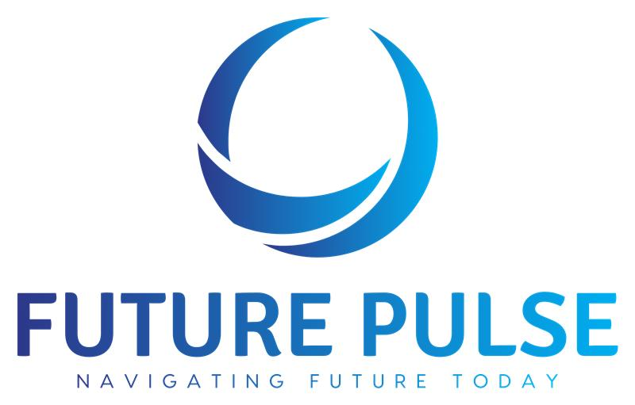
  

  <nav>
    <a href="#">Services</a>
    <a href="#">Careers</a>
    <a href="#">Case Studies</a>
    <a href="#">About Us</a>
    <a href="#">Blog</a>
    <a href="#" class="contact-btn">Contact Us</a>
  </nav>

</header>

<!-- ================= HERO ================= -->

<section class="hero">

  

    <h1>
      Transform Your Business
      with AI-Powered
      CRM Automation
    </h1>

    

      Save thousands of hours with autonomous AI agents built using Salesforce Agentforce and Zoho.
    

    <a href="#" class="hero-btn">
      Book Free ROI Assessment
    </a>

  

</section>

<!-- ================= ABOUT ================= -->

<section class="about-section">

  

    

      

        

          
        

        

          
        

        

          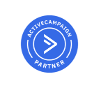
        

      

      <h2>
        We are certified partners for Zoho, Salesforce, and ActiveCampaign.
      </h2>

      

        Our expert team helps simplify workflows and increase growth.
      

      <a href="#" class="about-btn">
        Read More
      </a>

    

    

      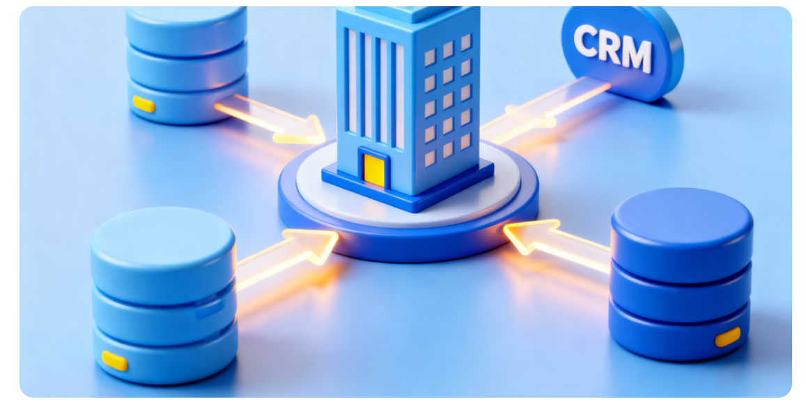
    

  

</section>

<!-- ================= EXPERIENCE ================= -->

<section class="experience-section">

  <h2 class="section-title">
    Our Experience
  </h2>

  

    Highlighting our deep proficiency in Salesforce implementation and integration.
  

  

    

      <h3>Salesforce Specialisation</h3>

      

        Expertise across Salesforce clouds and solutions.
      

    

    

      <h3>Zoho Specialisation</h3>

      
20+

      

        Salesforce and Zoho certified specialists
      

    

  

</section>

<!-- ================= PARTNER SLIDER ================= -->

<section class="partners">

  <h2>
    Our Globally Renowned Partners
  </h2>

  

    

      
      
      
      
      

      
      
      
      
      

    

  

</section>

<!-- ================= SALESFORCE ================= -->

  

    

      <h3>Salesforce Services</h3>

      

        

          ✔
          
Fast deployment for Sales, Service and Experience Cloud

        

        

          ✔
          
Custom objects, automations and dashboards

        

        

          ✔
          
Secure integrations with core business systems

        

        

          ✔
          
Ongoing support and performance optimisation

        

      

      <a href="#" class="service-btn">Read More</a>

    

    

      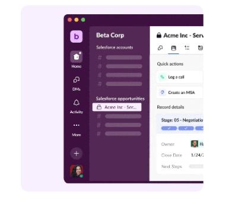
    

  

<!-- ================= ZOHO ================= -->

  

    

      <h3>Zoho Solutions</h3>

      

        

          ✔
          
CRM setup and workflow automation

        

        

          ✔
          
Custom apps with Zoho Creator

        

        

          ✔
          
Accounting and finance migration via Zoho Books

        

        

          ✔
          
Project management and analytics rollout

        

        

          ✔
          
HR, support desk, inventory tracking, and reporting

        

        

          ✔
          
Full suite orchestration and team training

        

      

      <a href="#" class="service-btn">Read More</a>

    

    

      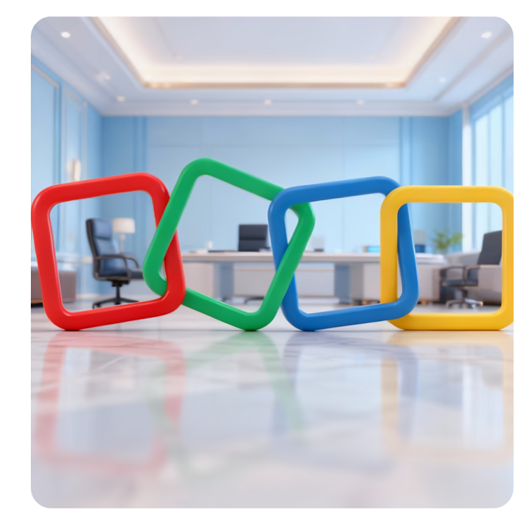
    

  

<!-- ================= WORKDAY ================= -->

  

    

      <h3>Workday Services</h3>

      

        

          ✔
          
HR and finance system implementation

        

        

          ✔
          
Secure migration and data integrity

        

        

          ✔
          
Integration with payroll and third-party tools

        

        

          ✔
          
Proactive support and troubleshooting

        

      

      <a href="#" class="service-btn">Read More</a>

    

    

      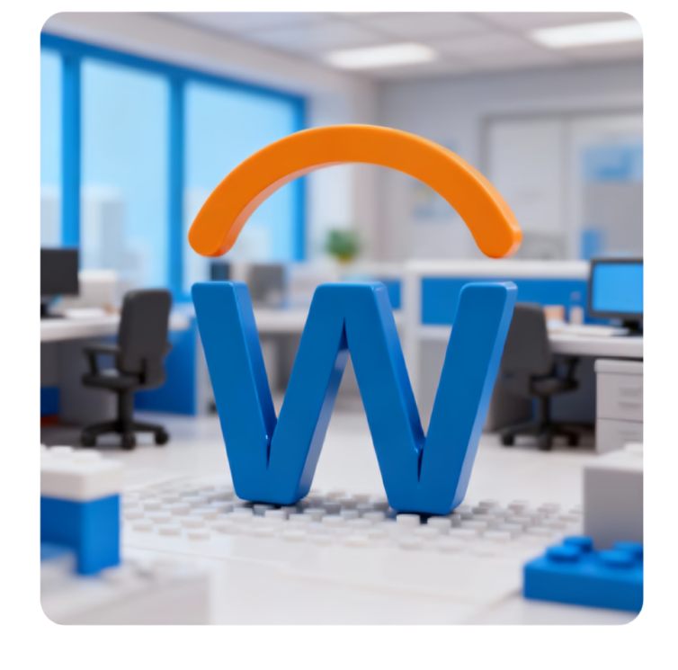
    

  

<!-- ================= MANAGED SERVICES ================= -->

  

    

      <h3>Managed Services</h3>

      

        

          ✔
          
Quarterly CRM health checks

        

        

          ✔
          
Admin support and user enablement

        

      

      <a href="#" class="service-btn">Read More</a>

    

    

      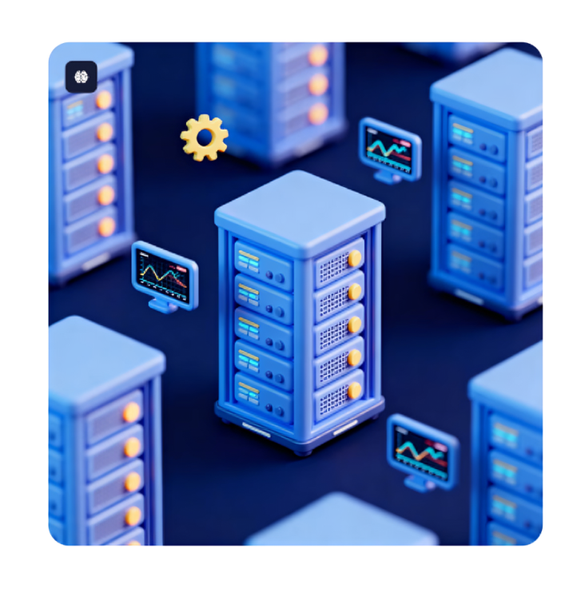
    

  

<!-- ================= CERTIFIED TALENT ================= -->

  

    

      <h3>Certified Talent Pool</h3>

      

        

          ✔
          
Rapid access to Salesforce and Workday experts

        

        

          ✔
          
Flexible staffing and project delivery

        

      

      <a href="#" class="service-btn">Read More</a>

    

    

      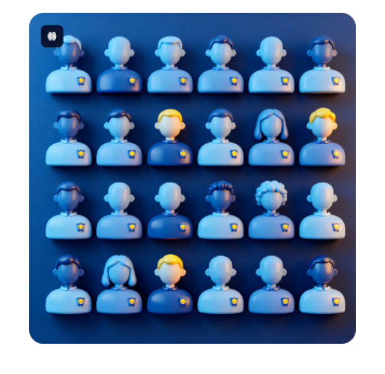
    

  

<!-- ================= AI ================= -->

  

    

      <h3>AI & Agentforce Automation</h3>

      

        

          ✔
          
Smart agents for support and lead qualification

        

        

          ✔
          
Automated reporting and operations

        

        

          ✔
          
Always-on responses and workflow recommendations

        

      

      <a href="#" class="service-btn">Read More</a>

    

    

      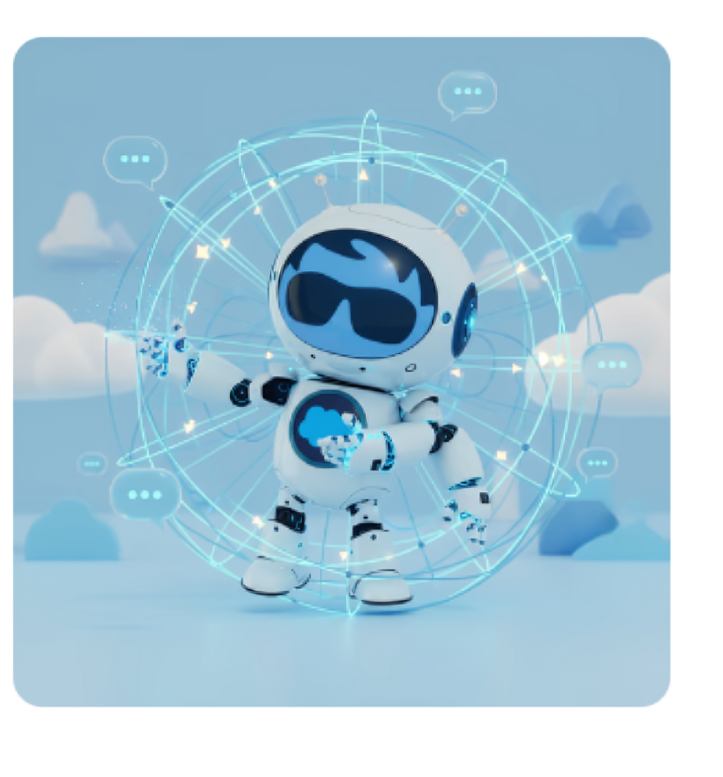
    

  

<!-- ================= CLIENT SLIDER ================= -->

<section class="client-slider-section">

  <h2>
    Our Globally Renowned Clients
  </h2>

  

    

      
      
      
      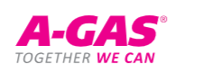
      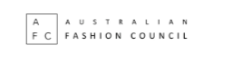

      
      
      
      
      

    

  

</section>
<!-- ================= INDUSTRIES SECTION ================= -->

  <section class="industries-section">

    

      <h1>
        Industries We Serve
      </h1>

      

        One Platform. Many Industries. Specialist Experience.
      

    

    

      <!-- USE YOUR SINGLE IMAGE HERE -->

      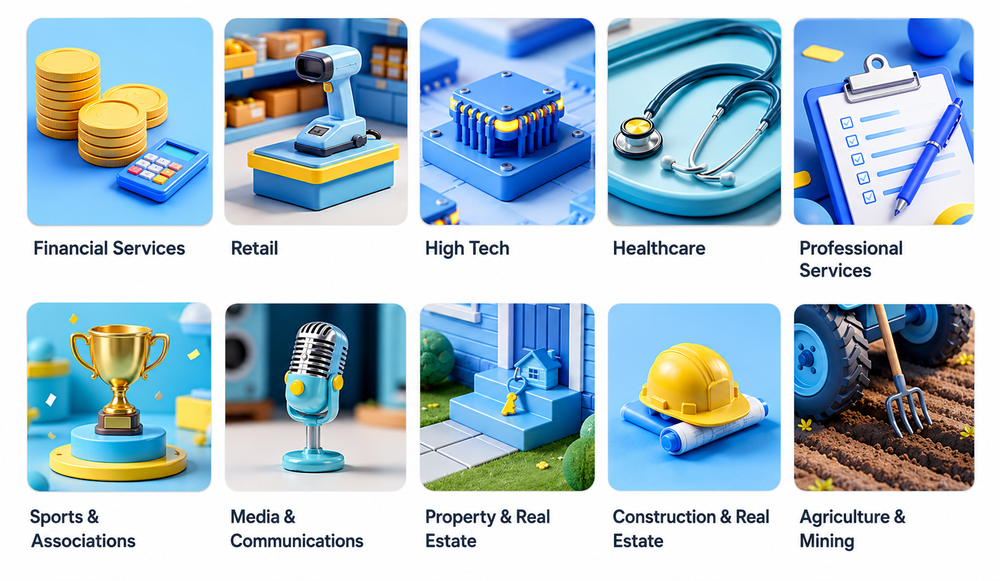

    

  </section>
 <!-- ================= CERTIFICATIONS SECTION ================= -->

  <section class="certifications-section">

    

      <h1>
        Our Certifications
      </h1>

      

        One Platform. Many Industries. Specialist Experience.
      

    

    

      <!-- USE YOUR SINGLE IMAGE -->

      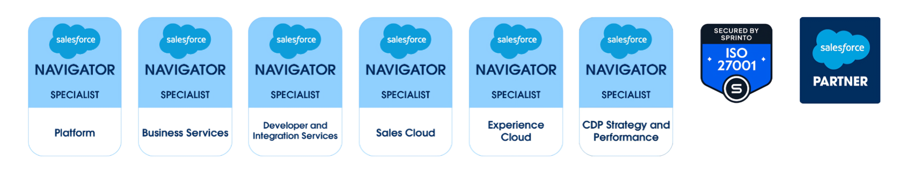

    

<!-- ================= BENEFITS SECTION ================= -->

<section class="benefits-section">

  

    ⚙ Features
  

  <h1 class="benefits-title">
    Key benefits that set us apart from other firms
  </h1>

  

    <!-- CARD 1 -->

    

      
⚙

      <h3>
        Autonomous AI Automation
      </h3>

      

        Agentforce AI eliminates repetitive tasks, saving 20+ hours weekly.
      

    

    <!-- CARD 2 -->

    

      
✎

      <h3>
        Elite Certified Expertise
      </h3>

      

        100+ Years Combined CRM Experience led by multiple Salesforce Architects.
      

    

    <!-- CARD 3 -->

    

      
▣

      <h3>
        Measurable, Guaranteed ROI
      </h3>

      

        Guaranteed results: 40% sales increase and 27% reduction in service costs.
      

    

    <!-- CARD 4 -->

    

      
◔

      <h3>
        End-to-End CRM Transformation
      </h3>

      

        Full lifecycle support: Strategy, Implementation, and Ongoing Managed Services.
      

    

    <!-- CARD 5 -->

    

      
▤

      <h3>
        Multi-Platform Ecosystem Mastery
      </h3>

      

        Official partners for Salesforce, Zoho, and Workday for unified systems.
      

    

    <!-- CARD 6 -->

    

      
◍

      <h3>
        Global Reach
      </h3>

      

        Melbourne HQ with global development resources.
      

    

  

</section>
<!-- ================= RESULTS SECTION ================= -->

<section class="results-section">

  

    ✓ Success Stories
  

  <h1>
    Measurable Results for Businesses
  </h1>

  

    <!-- BOX 1 -->

    

      <h2>40%</h2>
      

        Average increase in sales effectiveness
      

    

    <!-- BOX 2 -->

    

      <h2>27%</h2>
      

        Reduction in customer service costs
      

    

    <!-- BOX 3 -->

    

      <h2>20+</h2>
      

        Hours saved per week through automation
      

    

    <!-- BOX 4 -->

    

      <h2>95%</h2>
      

        Client satisfaction rating
      

    

  

</section>
</body>
</html>
